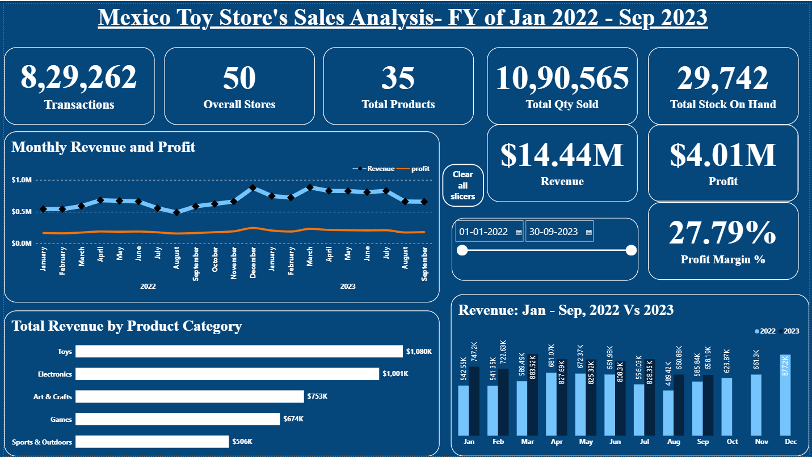
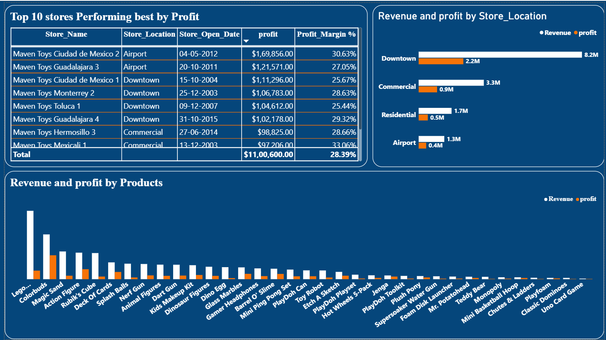
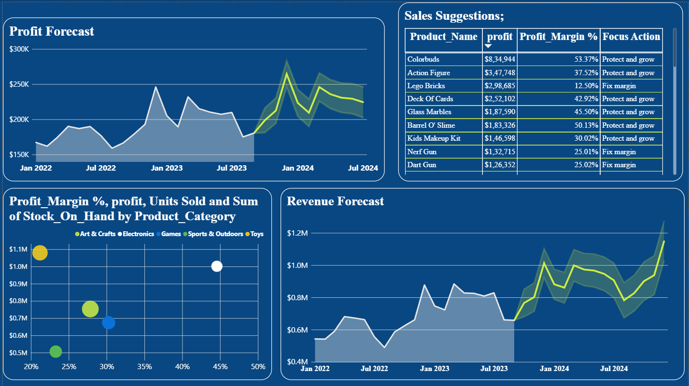

# Maven Toys: Sales Performance Dashboard

An interactive Power BI dashboard analyzing 829K+ sales transactions across 50 stores and 35 products (Jan 2022–Sep 2023), built to find what drives profit and forecast 2024 performance.

## Business Problem
A chain of 50 toy stores had no single view of what drives profit. Sales leadership, category managers, and store operations needed to see which products, categories, and stores drive profit, how sales move month to month, and where margin or stock is a problem.

## Project Objectives
- Which categories/stores drive the most profit, and does that hold across locations?
- How is revenue changing month to month, and is there seasonality?
- Which products have low profit or weak margin?
- How much money is tied up in inventory?
- What should 2024 targets look like?

## Dataset
[Mexico Toy Sales, Maven Analytics Data Playground](https://mavenanalytics.io/data-playground/mexico-toy-sales) — 829,262 transactions, Jan 2022–Sep 2023 (public domain).

## Tools Used
Power BI Desktop (Power Query, data model, DAX)

## Data Cleaning
- Removed `$` signs and trailing spaces from `Product_Cost` and `Product_Price`; converted to Decimal.
- Standardized inconsistent city name spelling (`Cuidad de Mexico` → `Ciudad de Mexico`).
- Added `Revenue`, `Cost`, and `Profit` columns at the row level, joined from `products` via relationship.

## Analysis Process
Built a relational model (Sales, Products, Stores, Inventory, Dates), wrote DAX measures for revenue, cost, profit, margin, and month-over-month growth, then designed a 3-page dashboard: Overview, Insights, and a 2024 Forecast with confidence intervals.

## Dashboard

## Key Insights
1. Revenue grew ~31% YoY (Jan–Sep: $5.32M → $6.96M).
2. The top 10 stores drove 27% of total profit.
3. Lego Bricks, the 3rd-highest-profit product ($298,685), carried only a 12.5% margin against 38–53% for other top sellers, due to a $5 markup on a $34.99 cost.

## Recommendations
- Test a 10% price increase on Lego Bricks; projected to add ~$239K in annual profit if demand holds. **Metric to watch:** units sold vs. price change.
- Investigate whether the top-10-store profit concentration reflects store age, location type, or something replicable. **Metric to watch:** profit per store, normalized by store count.

## Files Included
- `dashboard/sales_dashboard.pbix`
- `images/` — dashboard screenshots

## How to Use This Project
Open `dashboard/sales_dashboard.pbix` in Power BI Desktop. If prompted, point the data source to the CSVs from the dataset link above.
